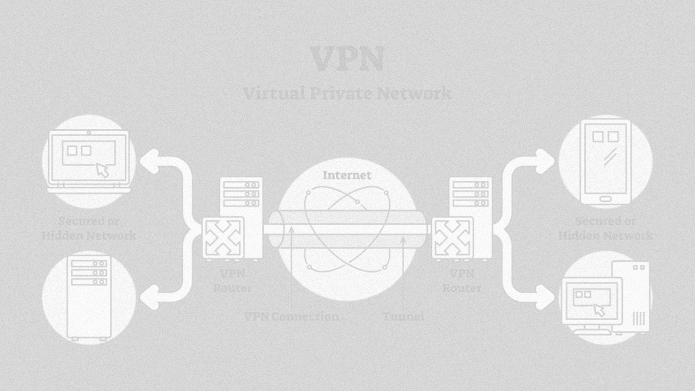

Udemy Course >> IPSec IKE VPN Tunnel P2P & P2MP IKEv2 Encryption Deployment

**********

Complete Crash Course >> How to Configure Deploy IPSec IKE VPN Tunnel + Site to Site & Hub Spoke IKEv2 Encryption Infrastructure + MikroTik Router IPSec Configuration (Azure Cloud Test Lab and Local VMware & Virtual-Box Test Lab)

**********

Tips/Tricks/Notes/Commands URL Link:

https://github.com/nimaxnimax/Udemy_IPSec_IKE_VPN_Tunnel_P2P_P2MP_IKEv2_Encryption_Deployment.git

Instructor & Courses:

https://www.udemy.com/user/adrian-fischer-infotech/

**********

Lab Requirements:

How to Download MikroTik Cloud Hosted Router & Winbox - VHDX/VMDK/VDI/OVA:
- https://mikrotik.com/download
- https://mt.lv/winbox64
- https://download.mikrotik.com/routeros/7.13.2/chr-7.13.2.vhdx.zip
- https://download.mikrotik.com/routeros/7.13.2/chr-7.13.2.vmdk.zip
- https://download.mikrotik.com/routeros/7.13.2/chr-7.13.2.vdi.zip
- https://download.mikrotik.com/routeros/7.13.2/chr-7.13.2.ova

Virtualization Options:
- https://www.vmware.com/uk/products/workstation-player/workstation-player-evaluation.html
- https://www.virtualbox.org/wiki/Downloads

MikroTik Router Products:
- https://mikrotik.com/products

**********

IPSec Site to Site (P2P) VPN/IKE Tunnel Encryption Deployment

IPsec (Internet Protocol Security) is a suite of protocols that provides secure communication over a network, such as the internet. When it comes to site-to-site VPNs (Virtual Private Networks) or point-to-point (P2P) VPNs, IPsec is commonly used to establish a secure and encrypted connection between two networks or endpoints. The key protocols within IPsec for VPN deployment are:

1. **Authentication Header (AH):** Provides authentication and integrity, ensuring that the data has not been altered in transit.

2. **Encapsulating Security Payload (ESP):** Provides confidentiality, integrity, and authentication for the data being transmitted.

To establish a secure site-to-site VPN, the Internet Key Exchange (IKE) protocol is often used to set up the IPsec security associations (SAs) between the communicating devices. IKE has two phases:

- **Phase 1 (IKEv1/IKEv2 Main Mode or Aggressive Mode):** In this phase, the devices negotiate keying material and establish a secure communication channel (ISAKMP SA) for further negotiations.

- **Phase 2 (Quick Mode):** Once the secure channel is established, the devices negotiate the IPsec SAs for encrypting and authenticating the actual user data.

Advantages of IPsec Site-to-Site VPN/IKE Tunnel Encryption Deployment:

1. **Security:** IPsec provides a high level of security by encrypting the data and authenticating the communication between sites. This ensures that sensitive information remains confidential and tamper-proof.

2. **Interoperability:** IPsec is a widely supported standard, ensuring compatibility between different vendors' networking equipment. This interoperability is crucial for creating VPN connections between devices from different manufacturers.

3. **Scalability:** Site-to-site VPNs using IPsec are scalable and can accommodate a growing number of connected sites or users without a significant increase in complexity.

4. **Flexibility:** IPsec can be configured to meet specific security requirements, allowing organizations to tailor the level of encryption, authentication, and key management according to their needs.

5. **Remote Access:** IPsec VPNs can be used for remote access scenarios, allowing users to connect securely to a corporate network from remote locations.

6. **Cost-Efficiency:** Using the internet as the transport medium for VPN connections can be cost-effective compared to dedicated private lines. IPsec VPNs leverage existing internet infrastructure, eliminating the need for expensive leased lines.

7. **Redundancy and Failover:** IPsec VPNs can be configured with redundancy and failover mechanisms to ensure continuous and reliable connectivity. This is achieved by using multiple VPN tunnels and dynamic routing protocols.

8. **Compliance:** IPsec is often used to meet regulatory compliance requirements, as it provides a strong security framework that aligns with various industry standards.

IPsec-based site-to-site VPNs with IKE tunnel encryption offer a robust and flexible solution for secure communication between geographically distributed networks. They are widely adopted in various industries to ensure the confidentiality, integrity, and authenticity of data transmitted over the internet.

**********

IPSec Hub/Spoke (P2MP) VPN/IKE Tunnel Encryption Deployment

IPsec Hub-and-Spoke, or Point-to-Multipoint (P2MP), VPN deployments involve a central hub connecting to multiple remote spoke sites. This architecture is commonly used when there is a need for a centralized hub to communicate securely with several remote branch offices or locations. The hub-and-spoke model is often seen in scenarios where one central location (the hub) serves as a main point of communication with multiple smaller locations (the spokes). IKE (Internet Key Exchange) is frequently used to establish and manage the security associations (SAs) necessary for secure communication.

Key Components of IPSec Hub-and-Spoke VPN:

1. **Hub:** The central location where the main network or data center is located. The hub serves as a point of aggregation for communication with multiple remote locations.

2. **Spokes:** The remote locations or branch offices that connect to the central hub. Each spoke communicates securely with the hub, but spokes typically do not communicate directly with each other.

3. **IPsec Security Associations (SAs):** Established between the hub and each spoke to secure the communication between them. This involves negotiation of encryption algorithms, authentication methods, and key management.

4. **IKE (Internet Key Exchange):** Facilitates the negotiation of security parameters and the establishment of SAs between the hub and each spoke.

Advantages of IPSec Hub-and-Spoke VPN/IKE Tunnel Encryption Deployment:

1. **Centralized Management:** The hub-and-spoke model allows for centralized management of security policies and VPN configurations. Changes can be implemented at the hub and applied to all spokes, simplifying administration.

2. **Efficient Use of Resources:** By aggregating traffic at the hub, there can be more efficient use of resources such as bandwidth and security appliances. This can lead to cost savings and better network performance.

3. **Scalability:** The hub-and-spoke architecture is scalable, making it easy to add new spokes as the network grows. This scalability is crucial for organizations with expanding branch offices or remote locations.

4. **Reduced Configuration Complexity:** The hub-and-spoke model reduces the complexity of configuring VPN connections compared to a fully-meshed topology where every site must connect to every other site. This simplifies configuration and troubleshooting.

5. **Traffic Optimization:** Centralized traffic flow through the hub allows for optimization and application of security policies, including traffic inspection and filtering, at a single point.

6. **Consistent Security Policies:** Security policies can be consistently applied across all spokes from the central hub, ensuring a uniform level of security throughout the network.

7. **Cost Savings:** Hub-and-spoke VPNs can lead to cost savings, especially in terms of reduced hardware requirements at individual spokes, as security services can be concentrated at the central hub.

8. **Improved Performance:** With traffic aggregation at the hub, network performance can be optimized, and the use of Quality of Service (QoS) mechanisms can be more effectively managed.

9. **Redundancy and High Availability:** The hub-and-spoke model allows for the implementation of redundancy and high availability configurations at the central hub to ensure continuous operation even in the event of a failure.

IPSec Hub-and-Spoke VPNs with IKE tunnel encryption provide a flexible and scalable solution for organizations with a central hub and multiple remote locations. This architecture offers centralized management, efficient resource utilization, and consistent security policies, making it suitable for various enterprise networking scenarios.

**********

Configuring and deploying an IPSec (Internet Protocol Security) IKE (Internet Key Exchange) VPN (Virtual Private Network) tunnel involves setting up a secure communication channel between two or more devices over the internet. This is commonly done to ensure the confidentiality, integrity, and authenticity of data transmitted between these devices. Let's break down the process and discuss the advantages.

Configure and Deploy IPSec IKE VPN Tunnel:

1. **Define VPN Requirements:**
   - Identify the devices that need to communicate securely.
   - Determine the IP addresses, subnets, and routing information for the VPN.
   - Choose the encryption and authentication algorithms to be used.

2. **Configure IKE Phase 1:**
   - Set up the parameters for the initial negotiation between devices.
   - Define the encryption and authentication methods for securing the IKE communication.
   - Establish a pre-shared key or certificates for authentication.

3. **Configure IKE Phase 2:**
   - Define the parameters for securing the actual data transmission.
   - Set up the encryption and integrity algorithms for the IPSec tunnel.
   - Establish a perfect forward secrecy mechanism if needed.

4. **Set Up IPSec Policies:**
   - Define the IPSec policies that will be applied to the traffic flowing through the VPN tunnel.
   - Specify the traffic selectors, encryption, and integrity settings.

5. **Establish VPN Tunnels:**
   - Implement the configured settings on both ends of the VPN connection.
   - Monitor and troubleshoot the connection to ensure successful establishment.

6. **Testing and Validation:**
   - Perform tests to verify the secure communication between the devices.
   - Ensure that the VPN tunnel is operational and meeting the defined security requirements.

Advantages of IPSec IKE VPN Tunnels:

1. **Security:**
   - IPSec provides a high level of security by encrypting data and ensuring the authenticity and integrity of the communication.

2. **Interoperability:**
   - IPSec is a widely adopted standard, leading to good interoperability between devices from different vendors.

3. **Remote Access and Site-to-Site Connectivity:**
   - IPSec VPNs support both remote access for individual users and site-to-site connectivity for connecting entire networks.

4. **Scalability:**
   - VPNs can be easily scaled to accommodate growing network requirements.

5. **Cost-Effective:**
   - VPNs over the internet eliminate the need for dedicated, expensive leased lines, making them a cost-effective solution.

6. **Flexibility:**
   - IPSec VPNs can operate in different modes, such as transport mode for end-to-end communication or tunnel mode for network-to-network communication.

7. **Support for Mobile Devices:**
   - IPSec VPNs are often supported on various platforms, including mobile devices, allowing secure communication for users on the go.

8. **Centralized Management:**
   - Centralized management tools simplify the configuration and monitoring of VPN connections.

9. **Compliance:**
   - VPNs help organizations meet regulatory and compliance requirements by securing sensitive data during transmission.

Remember that while IPSec VPNs provide strong security, proper configuration, ongoing monitoring, and updates are essential to maintain the effectiveness of the VPN infrastructure.

**********

Let's delve into Site-to-Site IPSec and Hub-and-Spoke IPSec IKEv2 VPNs, discussing their encryption methods and advantages.

Site-to-Site IPSec VPN:

1. **Definition:**
   - A Site-to-Site IPSec VPN is established between two or more network devices, such as routers or firewalls, at different physical locations. This creates a secure tunnel over the internet, allowing communication between the entire networks.

2. **Encryption in Site-to-Site IPSec:**
   - Site-to-Site IPSec VPNs typically use strong encryption algorithms in both IKEv1 and IKEv2 phases. Commonly employed encryption algorithms include AES (Advanced Encryption Standard) for data encryption and SHA (Secure Hash Algorithm) for integrity.

3. **Advantages:**
   - **Network Connectivity:** Enables secure communication between geographically distributed offices or data centers, forming an extension of a private network over the internet.
   - **Centralized Management:** Provides centralized control and management of security policies, making it easier to enforce consistent security measures across the entire network.

Hub-and-Spoke IPSec IKEv2 VPN:

1. **Definition:**
   - Hub-and-Spoke IPSec VPN is a network topology where a central hub (typically a main office or data center) is connected to multiple remote spokes (branch offices). All communication between spokes and the hub is routed through the central hub.

2. **Encryption in Hub-and-Spoke IPSec IKEv2:**
   - Hub-and-Spoke VPNs using IKEv2 benefit from its improved security features, such as support for stronger cryptographic algorithms. IKEv2 allows for flexibility in choosing encryption ciphers, offering options like AES-GCM for efficient encryption with authenticated encryption.

3. **Advantages:**
   - **Efficient Traffic Routing:** Hub-and-Spoke topology ensures that communication between remote spokes passes through the central hub. This centralized routing can optimize bandwidth usage and simplify network management.
   - **Scalability:** Easily scales to accommodate additional remote spokes without the need for direct connections between spokes.
   - **Reduced Configuration Complexity:** With a hub-centric design, changes to security policies and configurations are often managed centrally, reducing the complexity of configuring individual remote sites.
   - **Improved Resilience:** The central hub can act as a focal point for implementing additional security measures, and it can provide redundancy and failover capabilities, enhancing the overall resilience of the network.

Overall Advantages of IPSec IKEv2 Encryption:

1. **Strong Security:**
   - IKEv2 supports robust encryption algorithms, ensuring the confidentiality and integrity of data.

2. **Quick Negotiation and Reconnection:**
   - IKEv2 is known for its efficiency in negotiating and re-establishing VPN connections, making it suitable for scenarios where devices may frequently change networks (e.g., mobile devices).

3. **Mobility Support:**
   - Well-suited for scenarios where mobile users or remote offices need secure connectivity, offering features like seamless roaming between different networks.

4. **Resilience to Network Changes:**
   - IKEv2 handles network changes more gracefully, allowing for uninterrupted VPN connections even when switching between different network interfaces.

Remember to consider the specific requirements of your network, the level of security needed, and the scalability when choosing between Site-to-Site and Hub-and-Spoke VPN architectures and encryption methods.

**********

In IPSec (Internet Protocol Security), several terms and concepts are integral to understanding how secure communication is established and maintained. Here are definitions for key terms:

1. **IPSec (Internet Protocol Security):**
   - IPSec is a suite of protocols designed to secure Internet Protocol (IP) communication by authenticating and encrypting each IP packet within a communication session. It operates at the network layer and can be used to create Virtual Private Networks (VPNs) for secure communication over the internet.

2. **SA (Security Association):**
   - A Security Association is a set of security parameters that govern the secure communication between two devices. These parameters include encryption and authentication algorithms, keys, and other security attributes.

3. **AH (Authentication Header):**
   - AH is an IPSec protocol that provides authentication and integrity for IP packets. It ensures that the contents of the packets have not been altered during transmission.

4. **ESP (Encapsulating Security Payload):**
   - ESP is an IPSec protocol that provides confidentiality, integrity, and optional authentication for IP packets. It encrypts the payload of the packet, protecting the actual data being transmitted.

5. **MD5 (Message Digest Algorithm 5):**
   - MD5 is a cryptographic hash function that produces a fixed-size hash value, typically 128 bits. It was commonly used for integrity checks in IPSec, but due to vulnerabilities, it is now considered weak and is being replaced by more secure algorithms.

6. **SHA-1 (Secure Hash Algorithm 1):**
   - SHA-1 is a cryptographic hash function that produces a fixed-size hash value, typically 160 bits. Like MD5, it was widely used for integrity checks, but it is now considered weak for certain applications due to vulnerabilities.

7. **SHA-256 (Secure Hash Algorithm 256-bit):**
   - SHA-256 is part of the SHA-2 family and produces a 256-bit hash value. It is considered more secure than MD5 and SHA-1 and is commonly used for integrity checks and digital signatures.

8. **AES-128 and AES-256 (Advanced Encryption Standard):**
   - AES is a symmetric encryption algorithm. AES-128 uses a 128-bit key, and AES-256 uses a 256-bit key. These algorithms are widely used in IPSec for encrypting data, providing confidentiality in communication.

9. **PFS (Perfect Forward Secrecy):**
   - PFS is a feature that ensures that even if a long-term secret key is compromised, past communication cannot be decrypted. It involves generating unique session keys for each session, enhancing security.

10. **PSK (Pre-Shared Key):**
    - PSK is a method of authentication in which both communicating parties share a secret key in advance. It is a simple method but requires securely distributing and managing the pre-shared keys.

11. **P2P (Point-to-Point):**
    - P2P refers to a communication scenario where data is exchanged directly between two devices or endpoints, without intermediaries. In the context of IPSec, P2P can describe a point-to-point VPN connection between two devices.

Understanding these terms is crucial for configuring and managing IPSec VPNs and ensuring the security of communication over networks.

**********

IPSec and IKEv2 use several protocols and ports for communication between devices. When configuring firewalls to allow IPSec and IKEv2 traffic, it's important to ensure that the necessary protocols and ports are open. Here are the key protocols and ports associated with IPSec and IKEv2:

IPSec Protocols and Ports:

1. **IP Protocol 50 (ESP - Encapsulating Security Payload):**
   - Used for the transport of encrypted data. Ensure that this protocol is allowed through the firewall.

2. **IP Protocol 51 (AH - Authentication Header):**
   - Used for packet-level authentication and integrity. While AH is less commonly used than ESP, it may still be required in certain configurations.

3. **UDP 500 (IKE - Internet Key Exchange):**
   - Used for the negotiation and establishment of IPSec SAs (Security Associations). IKEv1 and IKEv2 both use UDP 500 for their initial negotiation.

4. **UDP 4500 (NAT Traversal for IPSec):**
   - Used for NAT traversal when IPSec traffic is passing through a Network Address Translation (NAT) device. This is particularly relevant for scenarios where one or both endpoints are behind a NAT device.

IKEv2-Specific Protocols and Ports:

1. **UDP 500 (IKEv2 Initial Exchange):**
   - Similar to IKEv1, IKEv2 also uses UDP 500 for the initial exchange. This port is used for the initial SA negotiation.

2. **UDP 4500 (IKEv2 NAT Traversal):**
   - As with IPSec, IKEv2 may use UDP 4500 for NAT traversal.

3. **Protocol 50 (ESP):**
   - IKEv2 often encapsulates its traffic within ESP, so allowing Protocol 50 is necessary for the secure transport of data.

4. **TCP 443 (IKEv2 over TLS):**
   - In some scenarios, IKEv2 may be encapsulated within TCP port 443 to traverse firewalls that only allow standard HTTPS traffic. This is known as IKEv2 over TLS (Transport Layer Security).

Note:
- The specific port numbers mentioned are default values, and they can be configured differently based on the requirements of the network.
- It's crucial to consider whether the devices involved in IPSec or IKEv2 communication are behind Network Address Translation (NAT), as this may affect the choice of ports and the need for NAT traversal.

When configuring firewalls, it's recommended to follow best practices for security, which may include restricting traffic to the minimum necessary and implementing proper authentication and encryption measures. Always refer to the documentation of your specific IPSec and IKEv2 implementations for any variations or additional considerations.

**********

In IPSec, the Diffie-Hellman (DH) Group and NAT Traversal are important concepts that play specific roles in establishing secure communication over networks. Let's delve into each of them:

IPSec DH Group (Diffie-Hellman Group):

**Definition:**
- The Diffie-Hellman (DH) algorithm is used in IPSec for key exchange, allowing two parties to agree upon a shared secret over an insecure channel. The DH Group defines the size of the prime number used in the DH key exchange process.

**DH Groups:**
- DH Groups are categorized by the size of the prime number used in the DH key exchange. Common DH Groups include Group 1, Group 2, Group 5, Group 14, Group 19, and so on, each using a progressively larger prime number.

**Differences and Advantages:**
1. **Key Length and Security:**
   - The primary difference between DH Groups lies in the size of the prime number, affecting the key length and, consequently, the security of the key exchange. Larger DH Groups generally provide higher security but may require more computational resources.

2. **DH Group Selection:**
   - The choice of DH Group depends on the security requirements of the network. For example, DH Group 2 (1024-bit key) was once common, but higher groups, like Group 14 (2048-bit key) or Group 19 (256-bit elliptic curve), are recommended for stronger security.

3. **Compatibility:**
   - When establishing an IPSec connection, both communicating parties must support the same DH Group. Higher DH Groups may not be supported by older devices or software, so compatibility considerations are important.

4. **Forward Secrecy:**
   - DH Groups also impact forward secrecy. Perfect Forward Secrecy (PFS) ensures that compromise of a long-term key does not compromise past session keys. Using a DH Group with PFS is a good practice for enhanced security.

NAT Traversal (Network Address Translation Traversal):

**Definition:**
- NAT Traversal is a technique used in IPSec to allow VPN traffic to pass through Network Address Translation (NAT) devices, such as routers or firewalls, without causing issues.

**Challenges with NAT and IPSec:**
- IPSec protocols encapsulate and encrypt packets, making it challenging for devices behind NAT to correctly process and forward them. This is due to changes in IP addresses and ports during the NAT process.

**Differences and Advantages:**
1. **NAT-T (NAT Traversal) Protocol:**
   - NAT Traversal is achieved using the NAT-T protocol, which encapsulates IPSec traffic within UDP (commonly on port 4500). This allows the IPSec packets to traverse NAT devices without being modified.

2. **Advantages:**
   - **Simplified Deployment:** NAT Traversal simplifies the deployment of IPSec VPNs in scenarios where one or both endpoints are behind NAT devices. It eliminates the need for complex NAT configurations or the manual adjustment of IP addresses in IPSec packets.

   - **Improved Compatibility:** NAT Traversal enhances compatibility with various network setups, enabling IPSec to work seamlessly across networks with different NAT configurations.

   - **Flexibility:** NAT Traversal provides flexibility in deploying VPNs, especially in environments where dynamic addressing or NAT is common, such as home networks or public Wi-Fi.

   - **Wider Reach:** The ability to traverse NAT facilitates the broader adoption of IPSec in diverse network environments, making it more accessible for remote users and branch offices.

IPSec DH Groups define the parameters for secure key exchange, and the choice of group influences security and compatibility. NAT Traversal, on the other hand, addresses challenges posed by Network Address Translation, allowing IPSec traffic to traverse NAT devices and ensuring broader deployment options. Both concepts are crucial in designing and implementing secure and flexible IPSec VPNs.

**********

Here are some MikroTik router products along with some key specifications related to network throughput, RAM, CPU, and the number of Gigabit and 10 Gigabit interfaces:

1. **MikroTik RouterBOARD RB4011 Series:**
   - Network Throughput: Up to 7.5 Gbps
   - CPU: Quad-core ARM Cortex A15
   - RAM: 1 GB
   - Gigabit Interfaces: 10x Gigabit Ethernet ports
   - 10 Gigabit Interfaces: 1x 10G SFP+ port

2. **MikroTik RouterBOARD RB1100AHx4:**
   - Network Throughput: Up to 7.5 Gbps
   - CPU: Quad-core Cortex A15
   - RAM: 1 GB
   - Gigabit Interfaces: 13x Gigabit Ethernet ports

3. **MikroTik RouterBOARD CCR1009 Series:**
   - Network Throughput: Up to 1.2 Gbps
   - CPU: 9-core Tilera Tile-Gx9
   - RAM: 2 GB
   - Gigabit Interfaces: 1x Gigabit Ethernet port
   - 10 Gigabit Interfaces: 1x 10G SFP+ port

4. **MikroTik RouterBOARD CCR1036 Series:**
   - Network Throughput: Up to 24 Gbps
   - CPU: 36-core Tilera Tile-Gx36
   - RAM: 4 GB
   - Gigabit Interfaces: 4x Gigabit Ethernet ports
   - 10 Gigabit Interfaces: 1x 10G SFP+ port

5. **MikroTik RouterBOARD CCR1072 Series:**
   - Network Throughput: Up to 72 Gbps
   - CPU: 72-core Tilera Tile-Gx72
   - RAM: 8 GB
   - Gigabit Interfaces: 8x Gigabit Ethernet ports
   - 10 Gigabit Interfaces: 1x 10G SFP+ port

6. **MikroTik RouterBOARD CCR2004 Series:**
   - Network Throughput: Up to 4 Gbps
   - CPU: Quad-core ARM 64-bit
   - RAM: 4 GB
   - Gigabit Interfaces: 4x Gigabit Ethernet ports
   - 10 Gigabit Interfaces: 2x 10G SFP+ ports

7. **MikroTik RouterBOARD RB3011 Series:**
   - Network Throughput: Up to 10 Gbps
   - CPU: Dual-core ARM Cortex A15
   - RAM: 1 GB
   - Gigabit Interfaces: 10x Gigabit Ethernet ports
   - 10 Gigabit Interfaces: 1x 10G SFP+ port

8. **MikroTik RouterBOARD RB2011 Series:**
   - Network Throughput: Up to 1 Gbps
   - CPU: Dual-core ARM Cortex A9
   - RAM: 128 MB or 256 MB
   - Gigabit Interfaces: 5x Gigabit Ethernet ports
   - 10 Gigabit Interfaces: N/A

9. **MikroTik RouterBOARD hEX Series (RB750Gr3):**
   - Network Throughput: Up to 1 Gbps
   - CPU: Quad-core ARM Cortex A7
   - RAM: 256 MB
   - Gigabit Interfaces: 5x Gigabit Ethernet ports
   - 10 Gigabit Interfaces: N/A

10. **MikroTik RouterBOARD hAP ac² (RB952Ui-5ac2nD):**
    - Network Throughput: Up to 1 Gbps
    - CPU: Quad-core IPQ-4018
    - RAM: 128 MB
    - Gigabit Interfaces: 5x Gigabit Ethernet ports
    - 10 Gigabit Interfaces: N/A

11. **MikroTik RouterBOARD RB941 Series (hAP lite):**
    - Network Throughput: Up to 300 Mbps
    - CPU: QCA9533
    - RAM: 32 MB
    - Gigabit Interfaces: N/A
    - 10 Gigabit Interfaces: N/A

12. **MikroTik RouterBOARD CRS3xx Series (Cloud Router Switch):**
    - Network Throughput: Varies by model
    - CPU: Varies by model
    - RAM: Varies by model
    - Gigabit Interfaces: Varies by model
    - 10 Gigabit Interfaces: Varies by model

Check the official MikroTik documentation for the most accurate and up-to-date information. Additionally, consider your specific network requirements and use case when choosing a router model.

**********

